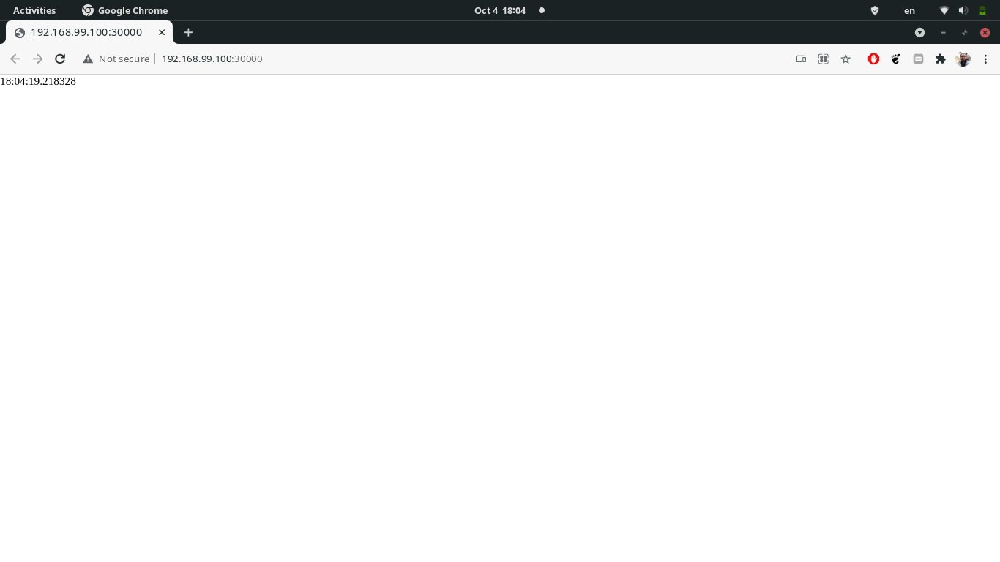

# Stateful sets

We created a stateful set from scratch, which later on turned out to be almost identical to the prior deployment...

```shell
$ kubectl --namespace=app-python get po,sts,svc,pvc,pv
NAME               READY   STATUS    RESTARTS   AGE
pod/app-python-0   1/1     Running   0          23m
pod/app-python-1   1/1     Running   0          22m
pod/app-python-2   1/1     Running   0          22m

NAME                          READY   AGE
statefulset.apps/app-python   3/3     23m

NAME                 TYPE           CLUSTER-IP     EXTERNAL-IP   PORT(S)          AGE
service/app-python   LoadBalancer   10.98.142.76   <pending>     8000:30000/TCP   23m

NAME                                        STATUS   VOLUME                                     CAPACITY   ACCESS MODES   STORAGECLASS   AGE
persistentvolumeclaim/visits-app-python-0   Bound    pvc-248c9673-1a52-436d-a7fb-a757f54532b1   32Mi       RWX            standard       23m
persistentvolumeclaim/visits-app-python-1   Bound    pvc-940929bb-49f4-4f87-9ae7-2899a5d7cc10   32Mi       RWX            standard       22m
persistentvolumeclaim/visits-app-python-2   Bound    pvc-fc36fab8-9e40-426e-a42c-7012eca036c0   32Mi       RWX            standard       22m

NAME                                                        CAPACITY   ACCESS MODES   RECLAIM POLICY   STATUS   CLAIM                            STORAGECLASS   REASON   AGE
persistentvolume/pvc-248c9673-1a52-436d-a7fb-a757f54532b1   32Mi       RWX            Delete           Bound    app-python/visits-app-python-0   standard                22m
persistentvolume/pvc-940929bb-49f4-4f87-9ae7-2899a5d7cc10   32Mi       RWX            Delete           Bound    app-python/visits-app-python-1   standard                22m
persistentvolume/pvc-fc36fab8-9e40-426e-a42c-7012eca036c0   32Mi       RWX            Delete           Bound    app-python/visits-app-python-2   standard                22m
```

We can access the service with

```shell
$ minikube --namespace=app-python service app-python
```

And then we can see the following page in the browser.



After refreshing the page several times, we can view the following values in the visits log

```shell
$ kubectl --namespace=app-python exec pod/app-python-0 -- cat /var/app-python/visits
17:36:47.511070
17:36:48.645548
18:24:43.809137
18:24:43.956889
18:24:44.545806
18:24:44.697377
18:24:44.970476
$ kubectl --namespace=app-python exec pod/app-python-1 -- cat /var/app-python/visits
17:36:48.019629
17:36:53.701679
17:37:17.575620
18:04:19.218328
18:24:44.092608
18:24:44.243052
18:24:45.099598
$ kubectl --namespace=app-python exec pod/app-python-2 -- cat /var/app-python/visits
17:36:48.164605
17:36:48.333706
17:36:48.502382
17:36:48.800126
17:36:48.948866
18:24:43.663598
18:24:44.392815
```

Refreshing this page gives different results since the load balancer forwards to different pods, which in turn fetch
data from different persistent volumes. We can verify this with

```shell
$ kubectl --namespace=app-python get pv
NAME                                       CAPACITY   ACCESS MODES   RECLAIM POLICY   STATUS   CLAIM                            STORAGECLASS   REASON   AGE
pvc-248c9673-1a52-436d-a7fb-a757f54532b1   32Mi       RWX            Delete           Bound    app-python/visits-app-python-0   standard                50m
pvc-940929bb-49f4-4f87-9ae7-2899a5d7cc10   32Mi       RWX            Delete           Bound    app-python/visits-app-python-1   standard                50m
pvc-fc36fab8-9e40-426e-a42c-7012eca036c0   32Mi       RWX            Delete           Bound    app-python/visits-app-python-2   standard                49m
```

Indeed, there are three different PV's assgined to three differnet PVC's. Without any syncing mechanism, these PV's will
naturally store different data.

In our app we do not need ordered pod launch, since our pods don't have any dependency among each other. We can inform
the cluster and specify `spec.podManagementPolicy: Parallel` in the stateful set manifest.

## Update strategies

Stateful sets support only two types of update strategies
- `RollingUpdate`: this is the default update strategy. In this strategy the pod update is completely automated by the
statefulset controller.
- `OnDelete`: here the user needs to explicitly delete pods for the statefulset to fire new pods from the updated
manifest. This can be needed in critical cases where you just want the cluster to stay out of your way for whatever
testing or paranoia reason.