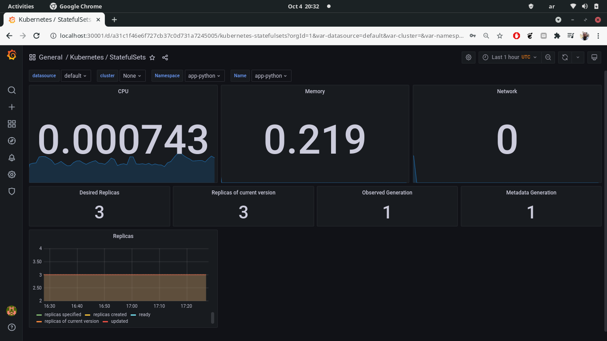
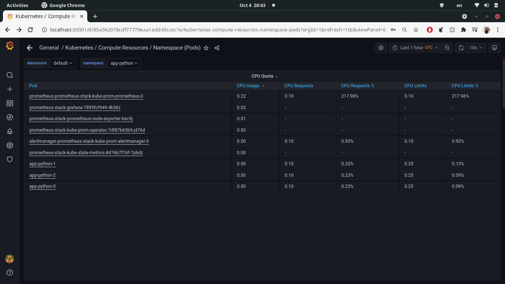
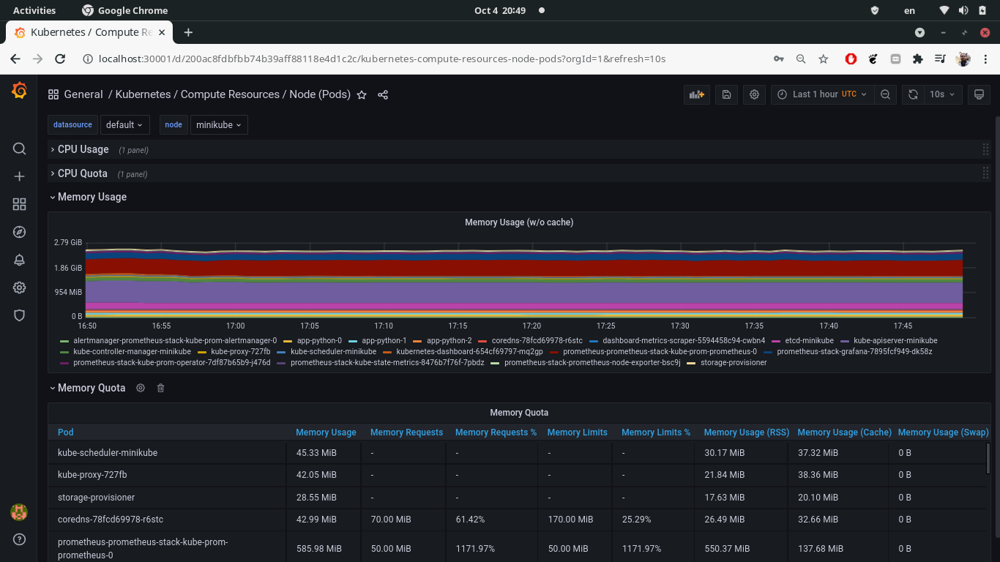
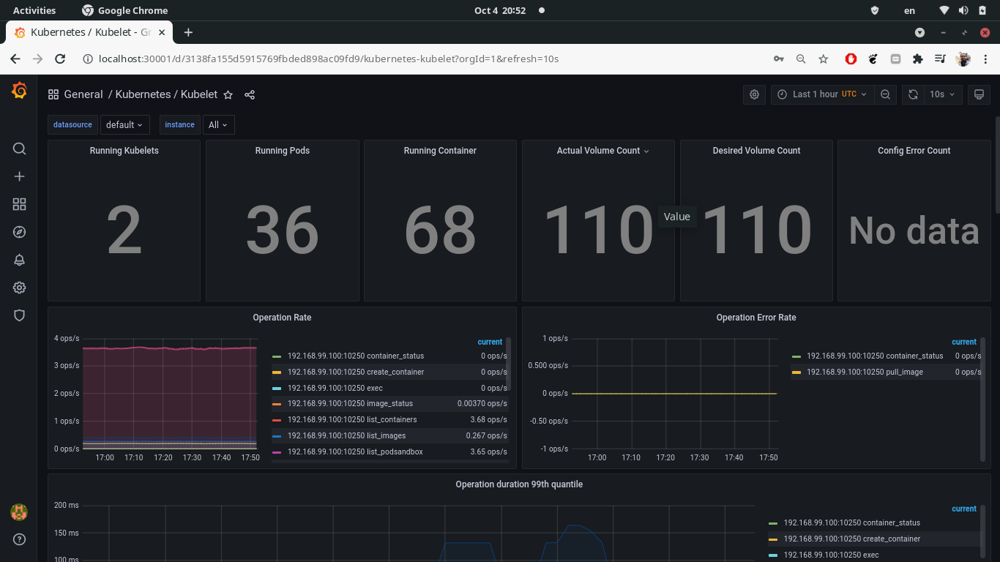
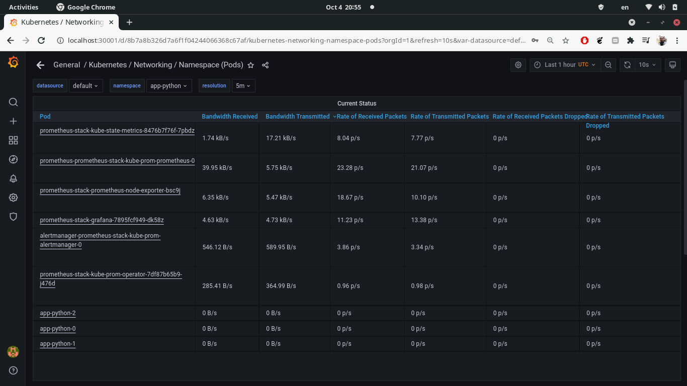
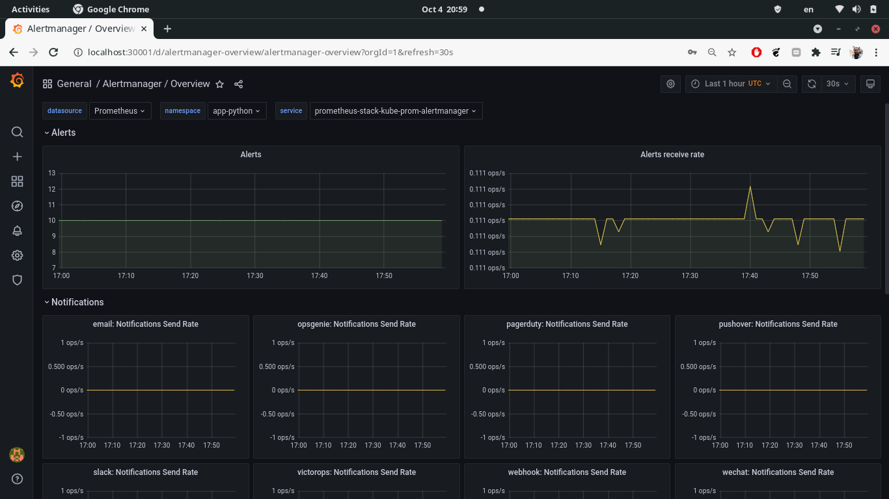

# Kube Prometheus

Kube Prometheus is a collection of components from the Prometheus stack packages as a helm package to ease the
configuration hell associated with monitoring Kubernetes clusters with bare Prometheus. It consists of
- The Prometheus Operator: a Kubernetes-native handler of Prometheus.
- Highly available Prometheus: just Prometheus... 
- Highly available Alertmanager: exactly what it sounds like.
- Node Exporter: a tool to retrieve low-level hardware and kernel metrics.
- Prometheus Adapter for Kubernetes Metrics APIs: pretty self-explanatory.
- Kube State Metrics: a simple service that generates metrics on the health of Kubernetes objects by inspecting
Kubernetes API server calls.
- Grafana: The human-facing metrics dashboard

First we installed and deployed the Kube Prometheus with

```shell
$ helm repo add prometheus-community https://prometheus-community.github.io/helm-charts
$ helm repo update
$ helm --namespace app-python install prometheus-stack prometheus-community/kube-prometheus-stack
```

Reviewing the cluster gives

```shell
$ kubectl --namespace=app-python get po,sts,svc,pvc,cm,deploy
NAME                                                         READY   STATUS    RESTARTS   AGE
pod/alertmanager-prometheus-stack-kube-prom-alertmanager-0   2/2     Running   0          23m
pod/app-python-0                                             1/1     Running   0          132m
pod/app-python-1                                             1/1     Running   0          131m
pod/app-python-2                                             1/1     Running   0          131m
pod/prometheus-prometheus-stack-kube-prom-prometheus-0       2/2     Running   0          23m
pod/prometheus-stack-grafana-7895fcf949-dk58z                2/2     Running   0          23m
pod/prometheus-stack-kube-prom-operator-7df87b65b9-j476d     1/1     Running   0          23m
pod/prometheus-stack-kube-state-metrics-8476b7f76f-7pbdz     1/1     Running   0          23m
pod/prometheus-stack-prometheus-node-exporter-bsc9j          1/1     Running   0          23m

NAME                                                                    READY   AGE
statefulset.apps/alertmanager-prometheus-stack-kube-prom-alertmanager   1/1     23m
statefulset.apps/app-python                                             3/3     132m
statefulset.apps/prometheus-prometheus-stack-kube-prom-prometheus       1/1     23m

NAME                                                TYPE           CLUSTER-IP       EXTERNAL-IP   PORT(S)                      AGE
service/alertmanager-operated                       ClusterIP      None             <none>        9093/TCP,9094/TCP,9094/UDP   23m
service/app-python                                  LoadBalancer   10.98.142.76     <pending>     8000:30000/TCP               132m
service/prometheus-operated                         ClusterIP      None             <none>        9090/TCP                     23m
service/prometheus-stack-grafana                    ClusterIP      10.107.244.65    <none>        80/TCP                       23m
service/prometheus-stack-kube-prom-alertmanager     ClusterIP      10.102.234.247   <none>        9093/TCP                     23m
service/prometheus-stack-kube-prom-operator         ClusterIP      10.100.80.142    <none>        443/TCP                      23m
service/prometheus-stack-kube-prom-prometheus       ClusterIP      10.107.156.184   <none>        9090/TCP                     23m
service/prometheus-stack-kube-state-metrics         ClusterIP      10.108.141.56    <none>        8080/TCP                     23m
service/prometheus-stack-prometheus-node-exporter   ClusterIP      10.96.117.41     <none>        9100/TCP                     23m

NAME                                        STATUS   VOLUME                                     CAPACITY   ACCESS MODES   STORAGECLASS   AGE
persistentvolumeclaim/visits-app-python-0   Bound    pvc-248c9673-1a52-436d-a7fb-a757f54532b1   32Mi       RWX            standard       132m
persistentvolumeclaim/visits-app-python-1   Bound    pvc-940929bb-49f4-4f87-9ae7-2899a5d7cc10   32Mi       RWX            standard       131m
persistentvolumeclaim/visits-app-python-2   Bound    pvc-fc36fab8-9e40-426e-a42c-7012eca036c0   32Mi       RWX            standard       131m

NAME                                                                     DATA   AGE
configmap/editor-config                                                  1      132m
configmap/kube-root-ca.crt                                               1      132m
configmap/prometheus-prometheus-stack-kube-prom-prometheus-rulefiles-0   28     23m
configmap/prometheus-stack-grafana                                       1      23m
configmap/prometheus-stack-grafana-config-dashboards                     1      23m
configmap/prometheus-stack-grafana-test                                  1      23m
configmap/prometheus-stack-kube-prom-alertmanager-overview               1      23m
configmap/prometheus-stack-kube-prom-apiserver                           1      23m
configmap/prometheus-stack-kube-prom-cluster-total                       1      23m
configmap/prometheus-stack-kube-prom-controller-manager                  1      23m
configmap/prometheus-stack-kube-prom-etcd                                1      23m
configmap/prometheus-stack-kube-prom-grafana-datasource                  1      23m
configmap/prometheus-stack-kube-prom-k8s-coredns                         1      23m
configmap/prometheus-stack-kube-prom-k8s-resources-cluster               1      23m
configmap/prometheus-stack-kube-prom-k8s-resources-namespace             1      23m
configmap/prometheus-stack-kube-prom-k8s-resources-node                  1      23m
configmap/prometheus-stack-kube-prom-k8s-resources-pod                   1      23m
configmap/prometheus-stack-kube-prom-k8s-resources-workload              1      23m
configmap/prometheus-stack-kube-prom-k8s-resources-workloads-namespace   1      23m
configmap/prometheus-stack-kube-prom-kubelet                             1      23m
configmap/prometheus-stack-kube-prom-namespace-by-pod                    1      23m
configmap/prometheus-stack-kube-prom-namespace-by-workload               1      23m
configmap/prometheus-stack-kube-prom-node-cluster-rsrc-use               1      23m
configmap/prometheus-stack-kube-prom-node-rsrc-use                       1      23m
configmap/prometheus-stack-kube-prom-nodes                               1      23m
configmap/prometheus-stack-kube-prom-persistentvolumesusage              1      23m
configmap/prometheus-stack-kube-prom-pod-total                           1      23m
configmap/prometheus-stack-kube-prom-prometheus                          1      23m
configmap/prometheus-stack-kube-prom-proxy                               1      23m
configmap/prometheus-stack-kube-prom-scheduler                           1      23m
configmap/prometheus-stack-kube-prom-statefulset                         1      23m
configmap/prometheus-stack-kube-prom-workload-total                      1      23m

NAME                                                  READY   UP-TO-DATE   AVAILABLE   AGE
deployment.apps/prometheus-stack-grafana              1/1     1            1           31m
deployment.apps/prometheus-stack-kube-prom-operator   1/1     1            1           31m
deployment.apps/prometheus-stack-kube-state-metrics   1/1     1            1           31m
```

In the output above we can see that Prometheus and Alertmanager components are attached to a stateful set, which is why
they have been dubbed "highly available" indicating their fault-tolerance as opposed to bare-metal deployment. Besides,
we have a deployments for the other components listed above (they are deployments rather than stateful sets because they
are naturally stateless).

Also, a bunch of services for each of the components is present, along with their config maps, nothing interesting
really.

We can now answer the following questions.

> Check how much CPU and Memory your StatefulSet is consuming.



> Check which Pod is using CPU more than others and which is less in the default namespace.

In our case we have separate namespace for our deployment, which is probably what you need.



> Check how much memory is used on your node, in % and mb.



> Check how many pods and containers actually ran by the Kubelet service.



> Check which Pod is using network more than others and which is less in the default namespace.



> Check how many alerts you have.



# Init containers

We will finally add a simple list of init containers that retrieves a file to the persistent volume, copies it, then
deletes the previous version.  After upgrading the chart we can check it works with

```yaml
$ kubectl --namespace=app-python exec pod/app-python-0 -- ls /var/app-python
Defaulted container "app-python" out of: app-python, get-typing-is-hard (init), copy-typing-is-hard (init), remove-old-typing-is-hard (init)
new_index.html
visits
```
