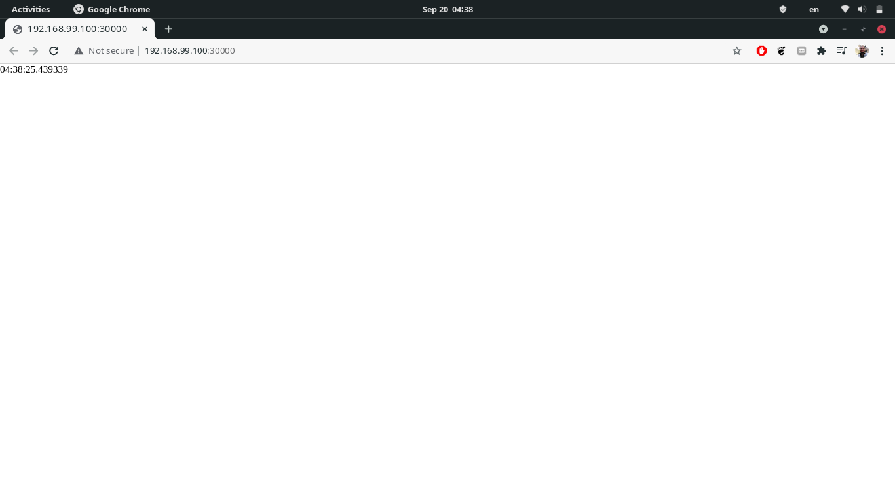

# Kubernetes

After installing `kubectl` and `minikube` we first created a namespace (for best practice) with
```shell
$ kubectl create namespace app-python
```
Then we went on to create a deployment
```shell
$ kubectl --namespace=app-python create deployment app-python --image=khaledismaeel/app_python --replicas=3 --port=8000
```
Then we made our application available outside the cluster by creating a `LoadBalancer` service for it.
```shell
$ kubectl --namespace=app-python expose deployment app-python --type=LoadBalancer
```
And that's it! We can check the status of our cluster with
```shell
$ kubectl get all --namespace=app-python
```
```
NAME                             READY   STATUS    RESTARTS   AGE
pod/app-python-f89bdb575-9f74n   1/1     Running   0          3m6s
pod/app-python-f89bdb575-c9gpg   1/1     Running   0          3m6s
pod/app-python-f89bdb575-vtlb2   1/1     Running   0          3m6s

NAME                 TYPE           CLUSTER-IP      EXTERNAL-IP   PORT(S)          AGE
service/app-python   LoadBalancer   10.99.183.216   <pending>     8000:30000/TCP   3m6s

NAME                         READY   UP-TO-DATE   AVAILABLE   AGE
deployment.apps/app-python   3/3     3            3           3m6s

NAME                                   DESIRED   CURRENT   READY   AGE
replicaset.apps/app-python-f89bdb575   3         3         3       3m6s
```

The above process can be automated by writing a declarative configuration in YAML. We could start from a well known 
example template and tweak it to our needs. Alternatively, we can generate the YAML configuration of the deployment and
the service with
```shell
$ kubectl get namespace app-python -o yaml > namespace.yaml
$ kubectl get deployment app-python -o yaml > deployment.yaml
$ kubectl get service app-python -o yaml > service.yaml
```
which generates the current configuration as fetched from `etcd`. We can trim off all the (seemingly)
automatically-generated entries to get a declarative version of our configuration. We can then run `kubectl apply` to
deploy our configuration.

We can also create a chart for our application by creating the [chart directory structure](charts/app-python) from scratch (we did not
`helm create`). We fetched the `Chart.yaml` example from the Helm documentation and tweaked it for our needs. Although
it is a best practice in larger configurations, this one is too little to use a template for.

Now we can spin up our application simply with
```shell
$ helm install app-python charts/app-python
```
We can check just like we did previously
```shell
$ kubectl get all --namespace=app-python
```
```
NAME                             READY   STATUS    RESTARTS   AGE
pod/app-python-f89bdb575-9f74n   1/1     Running   0          6m6s
pod/app-python-f89bdb575-c9gpg   1/1     Running   0          6m6s
pod/app-python-f89bdb575-vtlb2   1/1     Running   0          6m6s

NAME                 TYPE           CLUSTER-IP      EXTERNAL-IP   PORT(S)          AGE
service/app-python   LoadBalancer   10.99.183.216   <pending>     8000:30000/TCP   6m6s

NAME                         READY   UP-TO-DATE   AVAILABLE   AGE
deployment.apps/app-python   3/3     3            3           6m6s

NAME                                   DESIRED   CURRENT   READY   AGE
replicaset.apps/app-python-f89bdb575   3         3         3       6m6s
```
We can also navigate to the service in the browser
```shell
minikube --namespace app-python service app-python
```
And we will be presented with the following (incredibly informative) webpage


## Theoretical bonus

- Ingress: a set of rules and configurations to control access to the cluster _without regard to a particular
implementation_.
- Ingress controller: the software implementation of Ingress rules, most commonly NginX.
- Stateful set: similar to deployments, except that it treats pods as unique and not interchangeable. Particularly
useful for applications with a persistent state.
- Daemon set: similar to deployments, except that it deploys according to the available capacity and not the desired
state. That is, it will create pods on nodes satisfying certain criteria no matter how many pods are already running.
A useful use case is running logging pods on all nodes.
- Persistent volume: an abstraction of persistent storage the hides its true nature (local, cloud, etc).
- Library charts: charts which are not meant to be deployed but rather used as dependencies. They have been introduced
in Helm version 3 to mitigate accidental deployment of charts which are not meant to be deployed and other benefits.